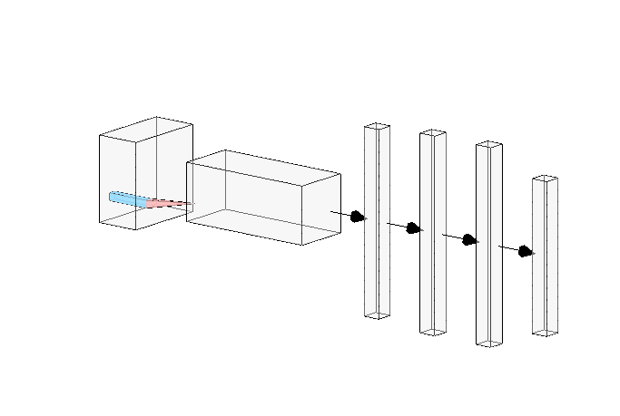

# Traffic sign classification with CNN
[Video to the output of the app](https://youtu.be/-M4ijljhEcI)
## Goal of the project
The main goal of this project was to create a Convolutional Neural Network that takes traffic sign images and utilizes computer vision to process the raw data and ultimately classifies them according to the category they belong to.

## Getting to know the dataset
The dataset I used for this comes from the [German Traffic Sign Recognition Benchmark](https://benchmark.ini.rub.de/?section=gtsrb&subsection=news) and it contains a series of images of different categories of road signs.

The data contains a series of subfolders for each of the 43 categories of traffic signs in the dataset, categories in the dataset varies and has images for stop signs, speed signs, direction signs as well as parking signs, among others.

## How the Neural Network is constructed
For this project `scikit-learn`, `tensorflow`, `opencv-python` were needed in order to build the architecture, as well as to process the data before feeding the actual neural network.

The data was processed at first using `cv2`, which contains functions for image loading and resizing. 

The neural network was created using `tensorflow` and it uses a Sequential model to pass along information across the network. It contains a Convolutional Layer for pattern learning, a pooling layer for dimension reduction. The data goes through both of these layers and is then flattened in order to feed the other hidden layers of the network, in this case there being two, with 128 neurons each. 

## Process of experimentation and intuition behind it
Ultimately, the neural network created contains the layers mentioned above, which mostly remained constant throughout the experimentation step of the project. Said experimentation was made mostly switching activation functions along the layers to try different configurations and see what worked better under a given set of circumstances, as well as moving around the convolutional layer's kernel size and the compiling settings. 

The intuition behind the final configuration arose from a few details noted during training:
1.  `relu` activation during convolutional is key for detecting which pixels are not useful for overall usage, that is, pixels outside of the attention focus of the image.
2.  `categorical_crossentropy` seemed to be the most appropriate function for calculating loss.
3.  `tanh` worked wonders in the dataset on the hidden layers, compared to any other activation function, due to how drastically it increases when the values are positive.

## Results achieved
During experimentations the accuracy measures obtained from the model varied a lot during early training runs, which was expected for a neural network built from zero.
However, the current configuration allows the model to learn fast during early epochs and ultimately balance itself during the last testing runs of the model.

The best accuracy obtained from the model after several attempts was *94.48%*.

## Conclusion
A simple Convolutional Neural Network proved to be very useful for classifying images from the dataset. A single convolutional layer facilitated the amount of work needed and increased the overall accuracy of the model, which is why this type of model is very popular for computer vision algorithms.
