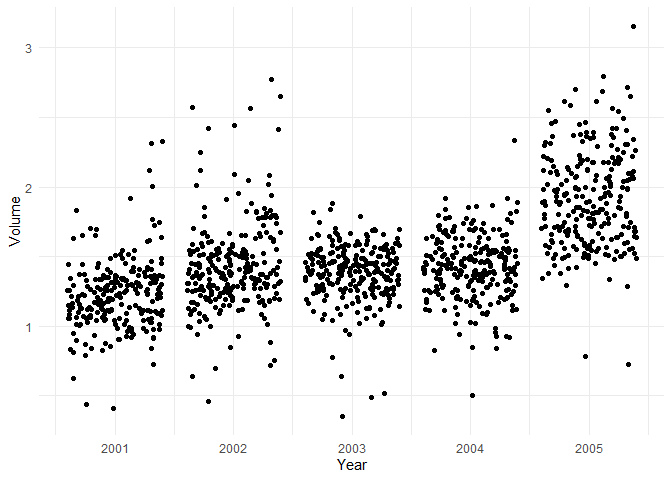
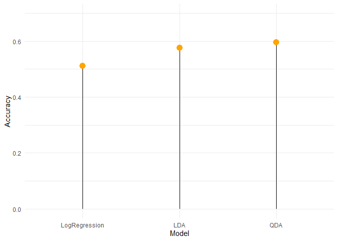

Stock Market Movement Classification
================

The main objective of this analysis is to create a Generalized Linear
Model based on a logistic regression model in order to classify, based
on a series of predictors, which direction is the market going on a
given day.

The data used for this analysis as well as the methodology can be found
in James et al. (2021). It contains a series of variables related to the
S&P 500, a few rows of the data is shown below. The lag columns
represent previous values for returns on the index and the `Direction`
column represents whether the market went up or down on that particular
day, based on the `Today` variable.

``` r
head(Smarket)
```

    ##   Year   Lag1   Lag2   Lag3   Lag4   Lag5 Volume  Today Direction
    ## 1 2001  0.381 -0.192 -2.624 -1.055  5.010 1.1913  0.959        Up
    ## 2 2001  0.959  0.381 -0.192 -2.624 -1.055 1.2965  1.032        Up
    ## 3 2001  1.032  0.959  0.381 -0.192 -2.624 1.4112 -0.623      Down
    ## 4 2001 -0.623  1.032  0.959  0.381 -0.192 1.2760  0.614        Up
    ## 5 2001  0.614 -0.623  1.032  0.959  0.381 1.2057  0.213        Up
    ## 6 2001  0.213  0.614 -0.623  1.032  0.959 1.3491  1.392        Up

Performing a simple descriptive analysis is straightforward with `R`.
From the output one can see that the variable `Direction` has only two
possible values and that they’re qualitative. During the fitting step of
the process the functions will create dummy variables to address this
non-quantitative predictor.

``` r
# Print basic statistics
summary(Smarket)
```

    ##       Year           Lag1                Lag2                Lag3          
    ##  Min.   :2001   Min.   :-4.922000   Min.   :-4.922000   Min.   :-4.922000  
    ##  1st Qu.:2002   1st Qu.:-0.639500   1st Qu.:-0.639500   1st Qu.:-0.640000  
    ##  Median :2003   Median : 0.039000   Median : 0.039000   Median : 0.038500  
    ##  Mean   :2003   Mean   : 0.003834   Mean   : 0.003919   Mean   : 0.001716  
    ##  3rd Qu.:2004   3rd Qu.: 0.596750   3rd Qu.: 0.596750   3rd Qu.: 0.596750  
    ##  Max.   :2005   Max.   : 5.733000   Max.   : 5.733000   Max.   : 5.733000  
    ##       Lag4                Lag5              Volume           Today          
    ##  Min.   :-4.922000   Min.   :-4.92200   Min.   :0.3561   Min.   :-4.922000  
    ##  1st Qu.:-0.640000   1st Qu.:-0.64000   1st Qu.:1.2574   1st Qu.:-0.639500  
    ##  Median : 0.038500   Median : 0.03850   Median :1.4229   Median : 0.038500  
    ##  Mean   : 0.001636   Mean   : 0.00561   Mean   :1.4783   Mean   : 0.003138  
    ##  3rd Qu.: 0.596750   3rd Qu.: 0.59700   3rd Qu.:1.6417   3rd Qu.: 0.596750  
    ##  Max.   : 5.733000   Max.   : 5.73300   Max.   :3.1525   Max.   : 5.733000  
    ##  Direction 
    ##  Down:602  
    ##  Up  :648  
    ##            
    ##            
    ##            
    ## 

``` r
# Also get correlation matrix for all columns except last one
cor(Smarket[,-9])
```

    ##              Year         Lag1         Lag2         Lag3         Lag4
    ## Year   1.00000000  0.029699649  0.030596422  0.033194581  0.035688718
    ## Lag1   0.02969965  1.000000000 -0.026294328 -0.010803402 -0.002985911
    ## Lag2   0.03059642 -0.026294328  1.000000000 -0.025896670 -0.010853533
    ## Lag3   0.03319458 -0.010803402 -0.025896670  1.000000000 -0.024051036
    ## Lag4   0.03568872 -0.002985911 -0.010853533 -0.024051036  1.000000000
    ## Lag5   0.02978799 -0.005674606 -0.003557949 -0.018808338 -0.027083641
    ## Volume 0.53900647  0.040909908 -0.043383215 -0.041823686 -0.048414246
    ## Today  0.03009523 -0.026155045 -0.010250033 -0.002447647 -0.006899527
    ##                Lag5      Volume        Today
    ## Year    0.029787995  0.53900647  0.030095229
    ## Lag1   -0.005674606  0.04090991 -0.026155045
    ## Lag2   -0.003557949 -0.04338321 -0.010250033
    ## Lag3   -0.018808338 -0.04182369 -0.002447647
    ## Lag4   -0.027083641 -0.04841425 -0.006899527
    ## Lag5    1.000000000 -0.02200231 -0.034860083
    ## Volume -0.022002315  1.00000000  0.014591823
    ## Today  -0.034860083  0.01459182  1.000000000

The correlation matrix showed that no relevant correlations are present
in the data set, aside from a `Volume ~ Year` which came out at around
.
A plot of this correlation is shown below. This is in a way intuitive,
as one would expect that the stock market trade volume increases over
the years as companies issue more stock.

<figure>

<figcaption aria-hidden="true">Jitter has been added to the plot for
ease of analysis.</figcaption>
</figure>

## Logistic Regression Analysis

For starters, we fit a simple logistic regression model on the data with
the full data set in order to get a full model with all relevant
variables included, this will help understand which variables might be
useful for future models.

In this first model we will not be using a testing set, the importance
of this approach lies on the fact that as mentioned before, we’re using
this first model to test which variables could be relevant, further
testing will assess both model training and model testing.

``` r
# First attempt at a logistic regression model
# Fit a model with lag variables and the volume
glm.fit <- glm(Direction ~ Lag1 + Lag2 + Lag3 + Lag4 + Lag5 + Volume, 
               data = Smarket, 
               family = "binomial") # Prediction can only take on two values
# Inspect the p-values for the model
summary(glm.fit)
```

    ## 
    ## Call:
    ## glm(formula = Direction ~ Lag1 + Lag2 + Lag3 + Lag4 + Lag5 + 
    ##     Volume, family = "binomial", data = Smarket)
    ## 
    ## Deviance Residuals: 
    ##    Min      1Q  Median      3Q     Max  
    ## -1.446  -1.203   1.065   1.145   1.326  
    ## 
    ## Coefficients:
    ##              Estimate Std. Error z value Pr(>|z|)
    ## (Intercept) -0.126000   0.240736  -0.523    0.601
    ## Lag1        -0.073074   0.050167  -1.457    0.145
    ## Lag2        -0.042301   0.050086  -0.845    0.398
    ## Lag3         0.011085   0.049939   0.222    0.824
    ## Lag4         0.009359   0.049974   0.187    0.851
    ## Lag5         0.010313   0.049511   0.208    0.835
    ## Volume       0.135441   0.158360   0.855    0.392
    ## 
    ## (Dispersion parameter for binomial family taken to be 1)
    ## 
    ##     Null deviance: 1731.2  on 1249  degrees of freedom
    ## Residual deviance: 1727.6  on 1243  degrees of freedom
    ## AIC: 1741.6
    ## 
    ## Number of Fisher Scoring iterations: 3

From the summary we can see that no predictors show a relavant
statistical significance, thus we can drop the highest *p-valued*
predictors from future models.

In order to get the overall training accuracy we create a vector with
length
,
where

represents the total amount of observations on the data set and we
change the values according to the results obtained with the model.

``` r
# Measure the overall training accuracy
glm.probs <- predict(glm.fit, type = 'response') # 'response' to get the actual calculated values

glm.pred <- rep('Down', length(Smarket[,1])) # Create vector of size [1250,] with all values 'Down'
glm.pred[glm.probs > .5] <- 'Up' # Substitute all values where 'Up' was predicted
rm(glm.probs)
```

Lastly, we compare the results vector with the original data to get the
accuracy.[^1]

``` r
# Get training accuracy
mean(glm.pred == Direction)
```

    ## [1] 0.5216

The overall accuracy for this model is around 52.16%, just marginally
better than guessing, not exactly a great result. Especially when
considering that this accuracy has been using the training set, which is
what one would expect the model is trying to minimize the error for.

### Assessing training accuracy

The following approach tries to get a better understanding of the
expected performance for the previous model. To achieve this, the data
set will be divided into a test set containing 80% of the data
observations and a test set containing the remaining 20%. A model will
be fitted using the training subset and the accuracy will be tested
against the test subset.

Aditionally, as stated previously, some predictors showed no particular
statistical significance when it comes to predicting the direction of
the market, so we’ll drop most of them and keep the two most
*significant* for our analysis, which in our case are `Lag1` and `Lag2`.

``` r
# Spliting the data set into training and testing
# Training on 4/5 of the data
training.set <- Smarket[training,]
# Test on 1/5 of the data
testing.set <- Smarket[testing,]

# Train a new model with training set
glm.fit <- glm(
  Direction ~ Lag1 + Lag2,
  data = training.set,
  family = "binomial"
)
```

``` r
# Get test accuracy
glm.acc <- mean(glm.pred == Direction[1:length(testing)])
glm.acc
```

    ## [1] 0.512

As seen in the previous output, the model accuracy using a testing set
is around 51.2%, which now is marginally worse than the previous model.
Clearly logistic regression is not a suitable classification model for
this data.

## Linear Discriminant Analysis

The next approach in this analysis is using an *LDA* model in search of
improving the performance obtained by the logistic regression approach
shown previously.

The same train-test approach will be followed from now on and most of
the code will be skipped to keep things simple, though it’ll be
available in the Github repository for review.

### Training the model

We’ll hereby train a Linear Discriminant Analysis using MASS library’s
`lda` function, which is essentially the same as the standard linear
model `lm` function. Note that the same two-variable subset will be used
for fitting instead of the whole variable set.

``` r
lda.fit <- lda(
  Direction ~ Lag1 + Lag2,
  training.set
)
```

### Testing the model

After fitting the model we can make predictions for the test set and get
a confusion matrix in order to analyze sensitivity and specificity.

``` r
# Test the accuracy of a linear approach
lda.pred <- predict(lda.fit, testing.set)
table(lda.pred$class, testing.set$Direction)
```

    ##       
    ##        Down  Up
    ##   Down   39  36
    ##   Up     70 105

The next code snippet provides the test accuracy for this particular
approach, which can also be calculated using the confusion matrix shown
above. Note how using linear discriminant analysis compared to logistic
regression the overall accuracy increased by more than 6%.

``` r
lda.acc <- mean(lda.pred$class == testing.set$Direction)
lda.acc
```

    ## [1] 0.576

## Quadratic Discriminant Analysis

The final approach which will be discussed in this report is the
quadratic discriminant analysis, which is esentially a polynomial
regression model for classification.

This model uses practically the same syntax as the previous example,
except that in this case the function used is MASS’ `qda`. The fitting
and testing of this model is as straighforward as the previous model.

``` r
qda.fit <- qda(
  Direction ~ Lag1 + Lag2,
  training.set
)
```

``` r
qda.pred <- predict(qda.fit, testing.set)
qda.acc <- mean(qda.pred$class == testing.set$Direction)
qda.acc
```

    ## [1] 0.596

This is actually a pretty good model for the data, close to 60% of
accuracy is an outstanding fit for predicting stock market fluctuations;
however, the table shown below provides more insight on the model’s
performance. As can be seen from the table, although the model did
improve in overall accuracy, caution must be given to the fact that this
model has a sensitivity of about 74.47% while having a specificty of
around 35.78%, which means that in this particular data set the model is
over-optimistic.

``` r
table(qda.pred$class, testing.set$Direction)
```

    ##       
    ##        Down  Up
    ##   Down   36  28
    ##   Up     73 113

## Final results

Finally the results for our tests can be seen in the following plot, for
this particular stock market data set it seems that the most useful
model is the Quadratic Discriminant Analysis model; however due to the
nature of stock market fluctuation this may not be true for other data
sets. Also, even though the overall accuracy improved progressively as
we moved across the models, sensitivity and specificity prove that not
only overall accuracy need to be taken into consideration when deciding
whether an actual model is or not useful.

<!-- -->

# Bibliography

<div id="refs" class="references csl-bib-body hanging-indent"
line-spacing="2">

<div id="ref-introstatlearn" class="csl-entry">

James, G., Witten, D., Hastie, T., & Tibshirani, R. (2021). *An
introduction to statistical learning: With applications in r* (2nd ed.).
Springer.

</div>

</div>

[^1]: To find out which value is assigned for the ranges
    ")
    and
    ![(0.5, 1\]](https://latex.codecogs.com/png.image?%5Cdpi%7B110%7D&space;%5Cbg_white&space;%280.5%2C%201%5D "(0.5, 1]")
    the contrasts() function was employed on the ‘Direction’ predictor
