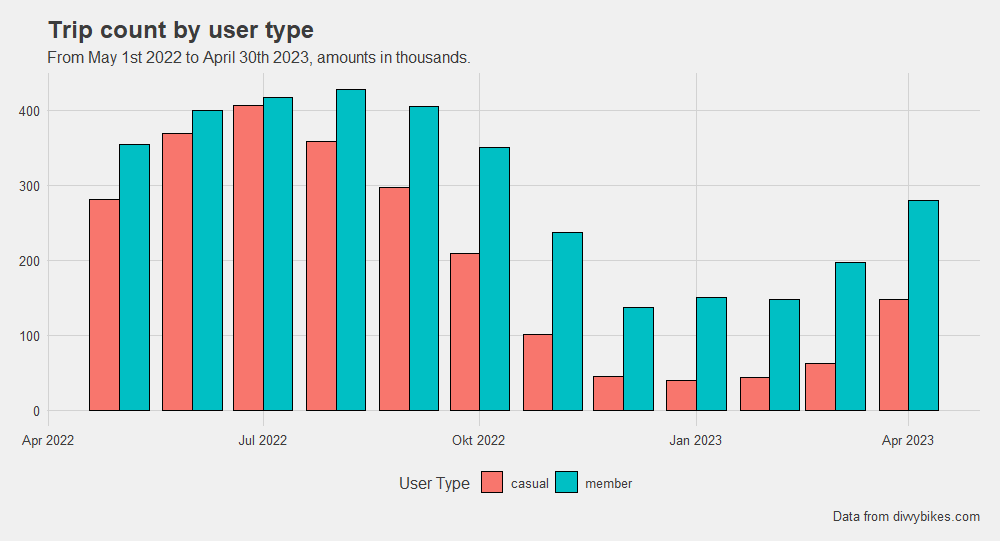
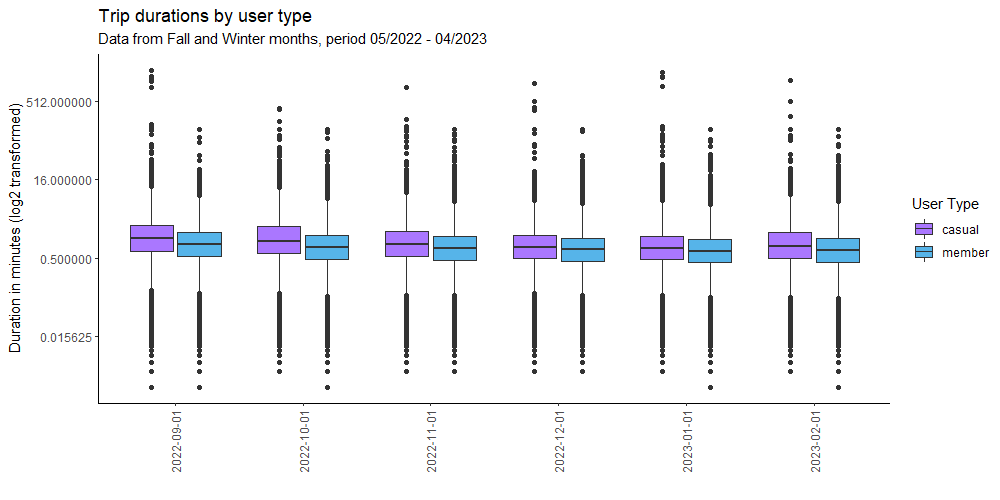
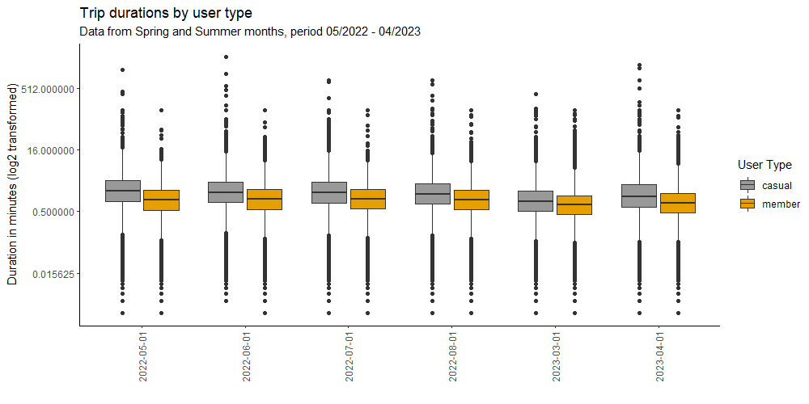

# Welcome to Bycicle analytics! :bike:
This is a project based on a case study from Google's Data Analytics Professional Certificate. It consists of analyzing monthly data from a company called Cyclistic, based on a real company called *Divvy*.

# Introduction
## Context
Cyclistic is a business that offers bike-sharing subscriptions to people in Chicago. The bikes can be unlocked from one station and
returned to any other station in the system anytime. Moreover, the company offers different types of membership alternatives that accomodate to users' preferences and needs, users that use single-trip and daily passes are referred to as 'casual' users, on the other hand, those who get annual memberships are referred to as 'members'. 

As you can already imagine, gathering usage data from this service is very important for the company and it's critical analysis plays a key role in decision-making and marketing.

According to finance analysts at Cyclistic, members are more profitable than casuals so the main goal of this case study is to analyze the way both of this consumer types behave in order to come up with useful insights that may help converting casual into members.

## How the data is being processed?
The language I'm using for this analysis is mostly `R`, and due to the nature of the language itself I've decided not to use a `SQL` database for querying over data and just do it all in plain `R`. 
The data used for this project has been downloaded directly from [Divvy's website](https://divvybikes.com/system-data) and hasn't been included in the files corresponding to this project due to storage constraints[^1]. However, any code used to load it, wrangle it, and overall manipulate it will be available in this repo.

## Questions to be answered 
1. How do annual members and casual riders use Cyclistic bikes differently?
2. Why would casual riders buy Cyclistic annual memberships?
3. How can Cyclistic use digital media to influence casual riders to become members?

# Getting to know the data
## How is the data structured?
| Column name | Description | Possible values |
| -- | -- | -- |
| `ride_id` | Contains a unique id for every ride in the database | Unique string |
| `rideable_type` | Contains the type of bike utilized for a trip | `classic_type`, `docked_bike`, `electric_bike` |
| `started_at`, `ended_at` | Contains the date at which the trip started and ended, respectively | Date type in ISO format |
| `start_station_name` | Contains the name of the station where the trip started | String representing the name |
| `start_station_id` | ID of the trip's starting station | Unique string for every station of variable size |
| `end_station_name` | Contains the name of the station where the trip ended | String representing the name |
| `end_station_id` | ID of the trip's ending station | Unique string for every station of variable size |
| `start_lat` | Latitude coordinate from the station at which the trip started | Coordinates in CRS |
| `start_lng` | Longitude coordinate from the station at which the trip started | Coordinates in CRS |
| `end_lat` | Latitude coordinate from the station at which the trip ended | Coordinates in CRS |
| `end_lng` | Longitude coordinate from the station at which the trip ended | Coordinates in CRS |
| `member_casual` | Type of member that took the trip|`casual`,`member`|

The raw data set contains more than 5.8 millions observations for trips from both members and casual users. Some of the basic visualizations contained in the first question do consider the full data set since it gives some useful insights. However, utilizing the full data set for the whole analysis is considered to be not optimal due to the demanding computational power required to process and plot the data; to address this and to 'descale' the data, 30,000 samples have been taken from the data set corresponding to every month for the period considered, and to prevent any concerns for the data not being representative, said samples have been taken at random.

## Question solving
### 1. How do annual members and casual riders use Cyclistic bikes differently?
#### Intuition prior to querying
Before writing any code, one can notice that the first question being asked requires us to carry out descriptive statistics, which can be accompanied by visualizations to make inferences clearer.

#### Important distinctions
As the question states, one of the main takeaways one should aim to get from the data is to understand how bike usage behavior diverts when comparing casual users with members.

A first approach to this is visualizing just how trip counts differ between both types of users. The following graph allows us to see that over the last year, members had more trips every single month than casual users.

The gap between trip counts every month seems to be shorter during warm months, *i.e.* spring and winter months, with the spread between trips in July 2022 being as close as around 1%.
The graph also allows us to see a very clear stationary pattern in the data; the combined trip count shows an increasing trend from january through july and then decreases back down from august onward.

This is consistent with trip duration over the same period, we see from the following two plots how durations change during winter and autumn.

This is obvious considering that bikes are not very popular to use during cold months in contrast with warmer ones. 

The plots also let us see something worth noting: **casual users tend to have longer trips than members** regarless of the time of the year and the biggest outliers come from casual users as well.

A density 

## Descriptive Statistics

[^1]: Although you shouldn't have any problems trying to reproduce the results achieved in this project, any critique and comment will be adressed as soon as possible to keep everything consistent.
